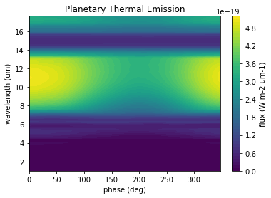
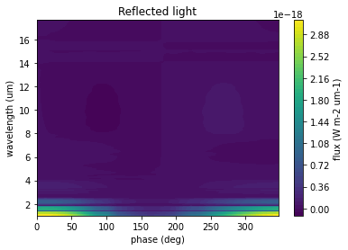
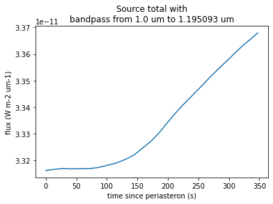
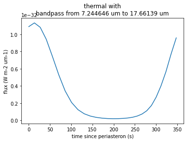
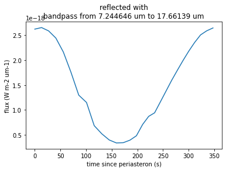
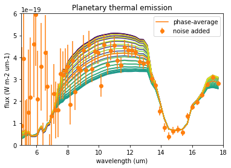
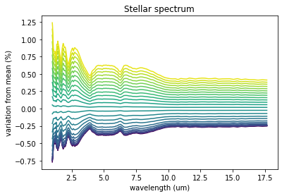

# VSPEC: Variable Star PhasE Curve

## A python package to simulate Planetary Infrared Excess (PIE) observations of rocky planets around variable M dwarfs

#### Cameron Kelehan and Ted Johnson

VSPEC uses a dynamic model of stellar spots and faculae combined with simultations from the Planetary Spectrum Generator (PSG, [Villanueva et al, 2018](https://ui.adsabs.harvard.edu/abs/2018JQSRT.217...86V/abstract)) to simulate phase resolved observations of planetary thermal emission spectra. This package was designed for the Mid-IR Exoplanet CLimate Explorer mission concept (MIRECLE, [Mandell et al, 2022](https://ui.adsabs.harvard.edu/abs/2022AJ....164..176M/abstract)), but was build to be used more generally.

### Installation

For now it is best to clone this repository, but we would like to use pypi in the future.

`git clone https://github.com/tedjohnson12/VSPEC.git`

`cd VSPEC`

`pip install -e .`

### Using VSPEC

#### Quick start guide

The parameters of a VSPEC model are specified in a configuration file. Before we run the model we will read these parameters into memory. The fundamental object in VSPEC is `VSPEC.ObservationalModel`.


```python
import VSPEC
from pathlib import Path
import matplotlib.pyplot as plt
from matplotlib import cm
from astropy import units as u
```


```python
config_path = 'example.cfg'
model = VSPEC.ObservationModel(config_path)
```

This created a new directory called `example_star/` that will store all the data from this model run.

Let's look at where our model parameters are stored. For example we can look at the effective temperature of quiet photosphere.


```python
model.params.teffStar
```


$3300 \; \mathrm{K}$


Now we need to bin the spectra to the desired resolution. In the configureation file we specified:


```python
print(f'starting wavelength = {model.params.lam1}')
print(f'ending wavelength = {model.params.lam2}')
print(f'resolving power = {model.params.lamRP}')
```

    starting wavelength = 1.0 um
    ending wavelength = 18.0 um
    resolving power = 50.0


We can ask the model to bin spectra from a grid of PHOENIX models. The $T_{eff}$ range is specified in the configuration file.


```python
model.bin_spectra()
```


    Binning Spectra:   0%|          | 0/13 [00:00<?, ?it/s]


Now we make a series of API calls to PSG to retrive spectra of the planet model. The configuration file specifies a GCM file that is uploaded to PSG in `model.params.gcm_file_path`.


```python
model.build_planet()
```

    Starting at phase 0.0 deg, observe for 17000.0 min in 28 steps
    Phases = [  0.    13.23  26.93  41.11  55.69  70.59  85.69 100.83 115.85 130.63
     145.05 159.02 172.53 185.55 198.11 210.26 222.05 233.55 244.82 255.92
     266.94 277.94 288.99 300.16 311.52 323.14 335.08 347.41] deg


    Build Planet:   0%|          | 0/28 [00:00<?, ?it/s]


Lastly, we need to run our variable star model. PSG uses its own stellar templates, but we will replace those with our own model. This allows us to accurately model the affect that variability has on reflected light as well as noise.


```python
model.build_spectra()
```


    Spot Warmup:   0%|          | 0/30 [00:00<?, ?it/s]


    Facula Warmup:   0%|          | 0/72 [00:00<?, ?it/s]


    Build Spectra:   0%|          | 0/28 [00:00<?, ?it/s]


#### Analysis

All of our data produced by this model run is stored in `example_star/Data/AllModelSpectraValues`. We can store that data in the `PhaseAnayzer` object.


```python
data_path = Path('example_star/Data/AllModelSpectraValues')
sim_data = VSPEC.PhaseAnalyzer(data_path)
```


```python
plt.contourf(sim_data.phase,sim_data.wavelength,sim_data.thermal,levels=60)
plt.xlabel('phase (deg)')
plt.ylabel('wavelength (um)')
plt.title('Planetary Thermal Emission')
cbar = plt.colorbar()
cbar.set_label('flux (W m-2 um-1)')
```


    

    


```python
plt.contourf(sim_data.phase,sim_data.wavelength,sim_data.reflected,levels=60)
plt.xlabel('phase (deg)')
plt.ylabel('wavelength (um)')
plt.title('Reflected light')
cbar = plt.colorbar()
cbar.set_label('flux (W m-2 um-1)')
```


    

    


We can also create lightcurves


```python
pixel = (0,10)
bandpass = sim_data.wavelength[slice(*pixel)]
plt.plot(*sim_data.lightcurve('total',(0,10),'phase'))
plt.xlabel('time since periasteron (s)')
plt.ylabel('flux (W m-2 um-1)')
plt.title(f'Source total with\nbandpass from {bandpass.min()} to {bandpass.max()}')
```


    Text(0.5, 1.0, 'Source total with\nbandpass from 1.0 um to 1.195093 um')


    

    


```python
pixel = (100,150)
bandpass = sim_data.wavelength[slice(*pixel)]
plt.plot(*sim_data.lightcurve('thermal',(0,10),'phase'))
plt.xlabel('time since periasteron (s)')
plt.ylabel('flux (W m-2 um-1)')
plt.title(f'thermal with\nbandpass from {bandpass.min()} to {bandpass.max()}')
```


    Text(0.5, 1.0, 'thermal with\nbandpass from 7.244646 um to 17.66139 um')


    

    


```python
pixel = (100,150)
bandpass = sim_data.wavelength[slice(*pixel)]
plt.plot(*sim_data.lightcurve('reflected',(0,10),'phase'))
plt.xlabel('time since periasteron (s)')
plt.ylabel('flux (W m-2 um-1)')
plt.title(f'reflected with\nbandpass from {bandpass.min()} to {bandpass.max()}')
```


    Text(0.5, 1.0, 'reflected with\nbandpass from 7.244646 um to 17.66139 um')


    

    


We can also look at the spectra produced at each phase step and combine multiple steps to improve SNR


```python
x = sim_data.wavelength
reg = x > 5*u.um
cmap = cm.get_cmap('viridis')
for i in range(sim_data.N_images):
    ytrue=sim_data.combine('thermal',(i,i+1),noise=False)
    plt.plot(x[reg],ytrue[reg],c=cmap(i/sim_data.N_images))
phases = (0,sim_data.N_images)
ytrue=sim_data.combine('thermal',phases,noise=False)
y = sim_data.combine('thermal',phases,noise=True)
yerr = sim_data.combine('noise',phases,noise=True)
plt.errorbar(x[reg],y[reg],yerr=yerr[reg],fmt='o',c='C1',label='noise added')
plt.plot(x[reg],ytrue[reg],c='C1',label='phase-average')
plt.axis([5,18,0,6e-19])
plt.xlabel('wavelength (um)')
plt.ylabel('flux (W m-2 um-1)')
plt.legend()
plt.title('Planetary thermal emission')
```


    Text(0.5, 1.0, 'Planetary thermal emission')


    

    


```python
x = sim_data.wavelength
cmap = cm.get_cmap('viridis')
yavg = sim_data.combine('total',(0,sim_data.N_images),noise=False)
for i in range(sim_data.N_images):
    ytrue=sim_data.combine('total',(i,i+1),noise=False)
    plt.plot(x,100*(ytrue-yavg)/ytrue,c=cmap(i/sim_data.N_images))
plt.xlabel('wavelength (um)')
plt.ylabel('variation from mean (%)')
plt.title('Stellar spectrum')

```


    Text(0.5, 1.0, 'Stellar spectrum')


    

    


## TODO

* limb-darkenging parameter
* Fibonacci spiral to evenly space points
* flares
